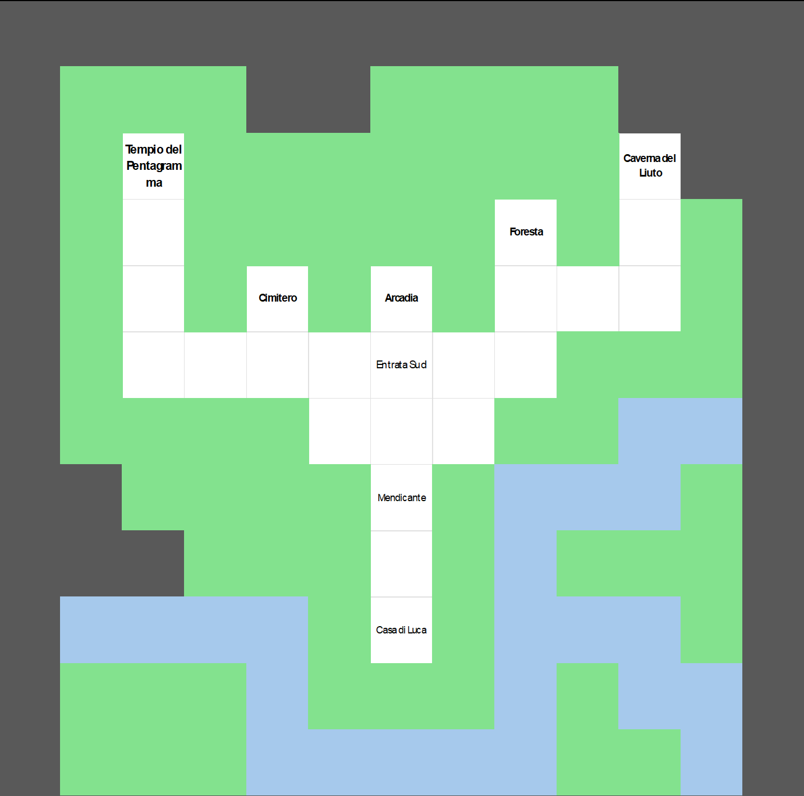
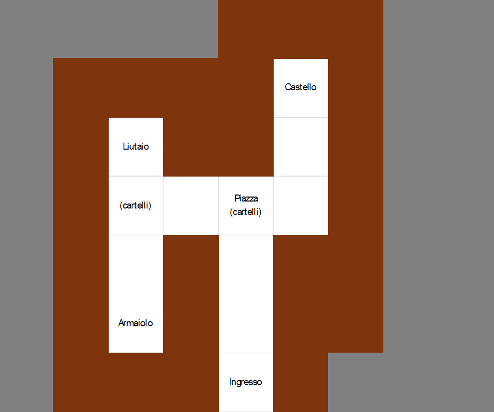
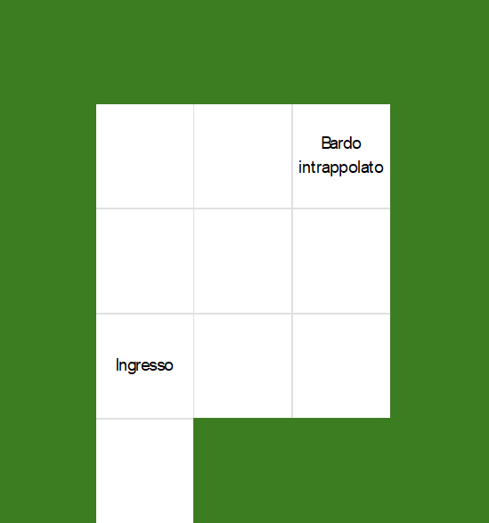
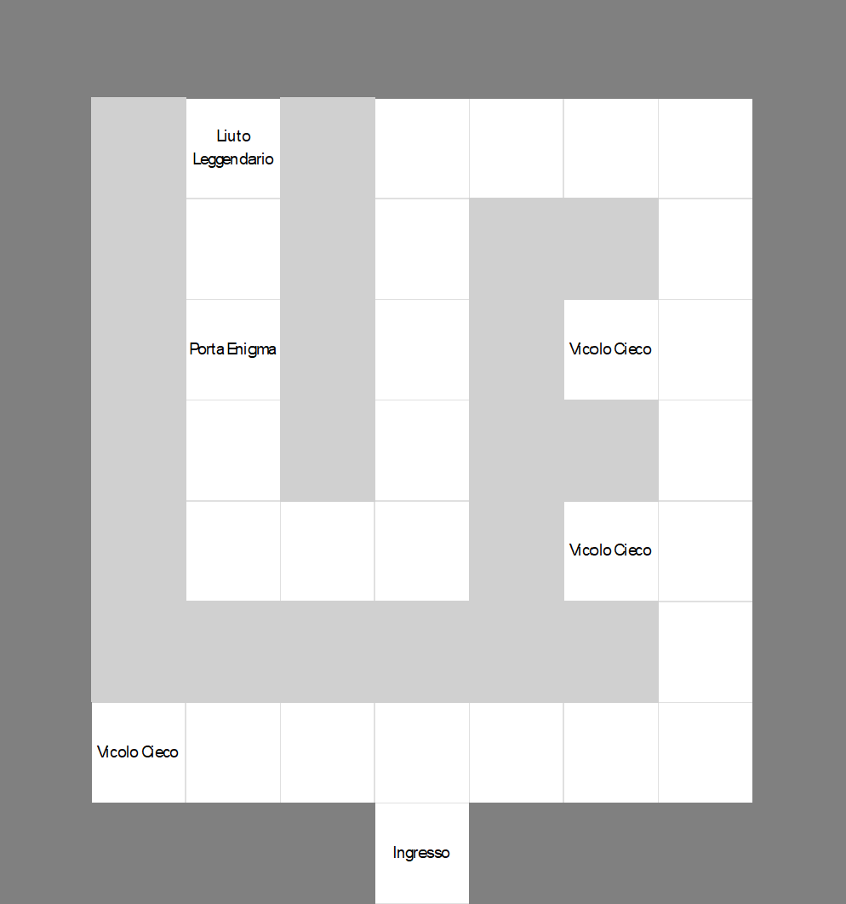
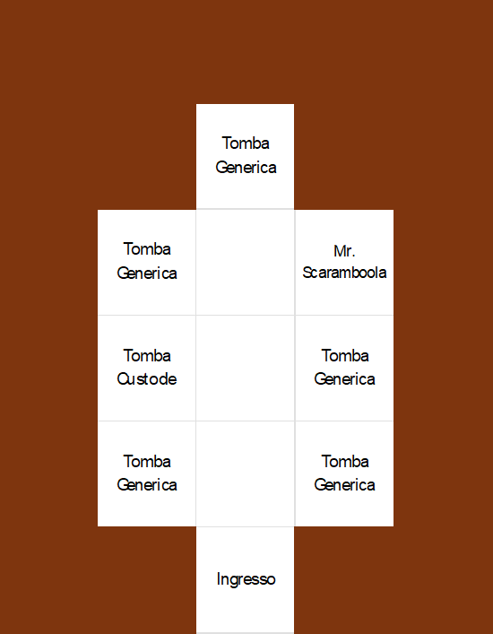
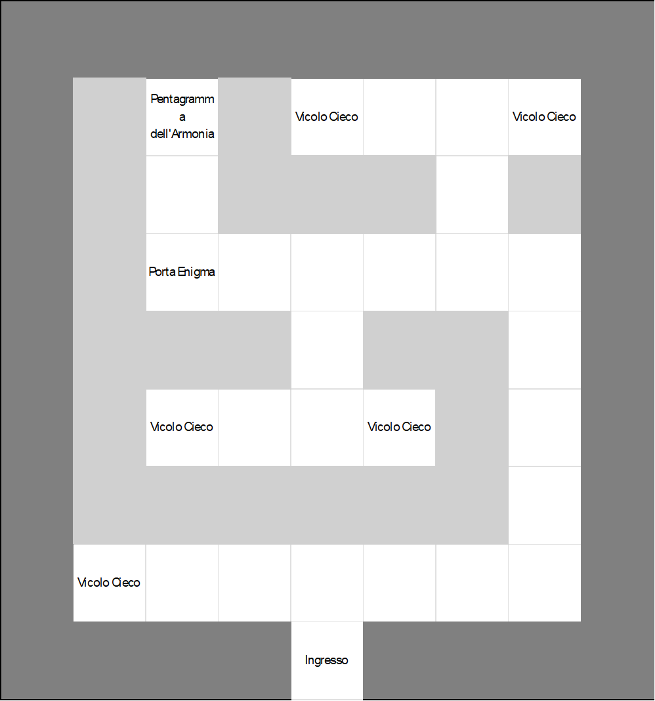

# Le Armonie del Custode
Videogioco realizzato in Java, da:  
&nbsp;&nbsp;&nbsp;&nbsp;&nbsp;&nbsp;•&nbsp;&nbsp;&nbsp;&nbsp;[Alessandro Pellegrino](https://github.com/ale-pell)  
&nbsp;&nbsp;&nbsp;&nbsp;&nbsp;&nbsp;•&nbsp;&nbsp;&nbsp;&nbsp;[Kevin Saracino](https://github.com/kelvinsrcn)  

## Indice

1. **Descrizione del caso di studio**
    1.1 **_Presentazione gioco_**
    1.2 **_Mappa di gioco (SPOILER)_**

2. **Installazione e utilizzo del progetto**

3. **Soluzione del Gioco (SPOILER)**

### 1. Presentazione del gioco

Il _gioco_ si intitola: "**_Le Armonie del Custode_**", ne segue la sinossi:   
"Nel cuore del prospero reame di Arcadia, ove i boschi sussurrano antiche melodie e i fiumi serpeggiano come argentei nastri fra le valli, viveva un giovane pastore di nome Luca. Egli, con il dolce suono del suo liuto, recava gioia e letizia agli abitanti, colmandone i giorni di armonie celestiali.  
Ma ecco che il destino, imperscrutabile tessitore delle vicende umane, pose dinanzi a Luca una prova crudele: il suo amato strumento, compagno di innumerevoli melodie, si ruppe, privandolo del suo dono più prezioso. Così, senza esitazione, il giovane intraprese il cammino verso il cuore del Regno, là dove avrebbe potuto trovare chi fosse in grado di restituire vita alla sua musica.  
Tuttavia, il fato aveva intessuto una trama ancor più oscura. Un'orrenda sciagura colpì il Castello: un drago, terribile e feroce, piombò sul regno, seminando il terrore fra il popolo. Grida di disperazione riecheggiavano fra le mura, mentre il sovrano e i suoi sudditi tremavano dinnanzi alla furia della bestia.  
Sarà dunque Luca, umile pastore e menestrello, a dover fronteggiare l'infausto evento, a sciogliere le maglie del terrore e a riportare l’armonia dove ora regna il caos."

#### 1.2 Mappa del gioco

La Mappa di Gioco è la seguente:

    
Aprire per visualizzarla (SPOILER)

    <strong>Mondo Esterno: </strong>
      
     
    <strong>Arcadia: </strong>
      
     
    <strong>Foresta: </strong>
     
      
     
    <strong>Grotta del Liuto:</strong>
      
     
    <strong>Cimitero: </strong>
     
      
     
    <strong>Tempio del Pentagramma: </strong>
      

## 2. Installazione e utilizzo del progetto

Per scaricare e iniziare a giocare seguire i seguenti passaggi:
1. Clona il repository con il comando: `git clone https://github.com/Arcadia-Soft/Le-Armonie-del-Custode-Avventura-Mista.git`
2. Aprire nel proprio IDE di preferenza la sotto-cartella `LeArmonieDelCustode`
3. Eseguire il progetto, se necessario selezionare come classe main: `Starter.java`

## 3. Soluzione del Gioco

Si riporta in seguito la soluzione per finire il gioco (percorso breve):

  
 Aprire per la soluzione (SPOILER) 

N x4  
PARLA  
321  
E x2  
N  
E x2  
N x3  
E x3  
N x6  
O x3  
S x4  
O x2  
N  
BALLA NNSSEO  
N x3  
PRENDI Liuto Leggendario  
S x4  
E x2  
N x4  
E x3  
S x6  
O x3  
S x3  
O x2  
S  
O x4  
N x3  
O  
PRENDI Chiave del Tempio  
E  
S x3  
O x2  
N x4  
E x3  
N x4  
O x4  
USA Chiave del Tempio  
O  
N x2  
PRENDI Pentagramma Armonico  
S x2  
E x5  
S x4  
O x3  
S x4  
E x4  
N x4  
E  
N x2  
USA Liuto Leggendario  
FINE

